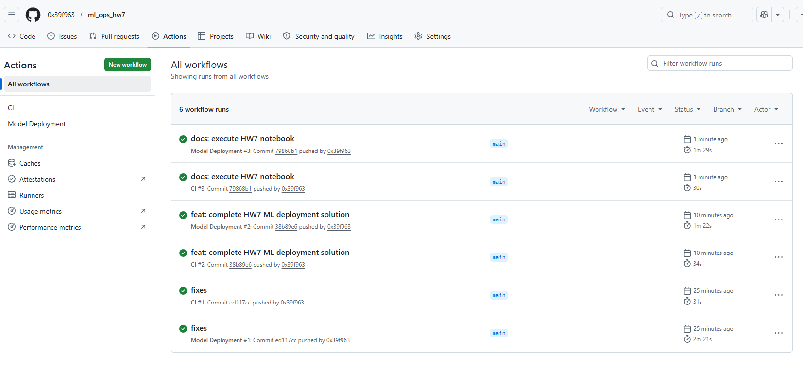
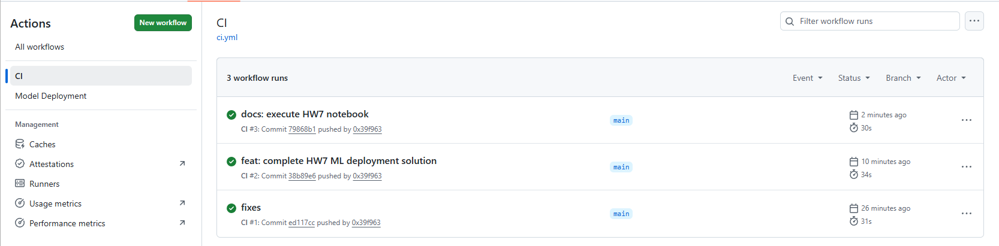
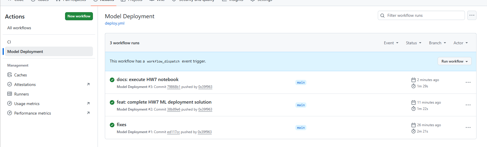
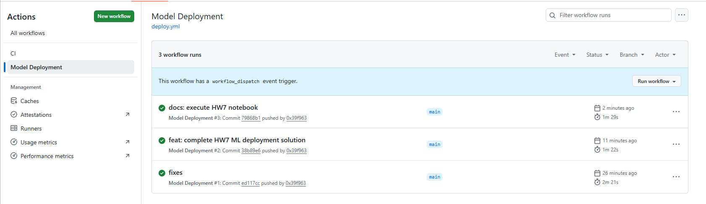
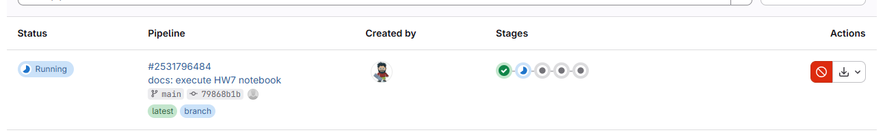
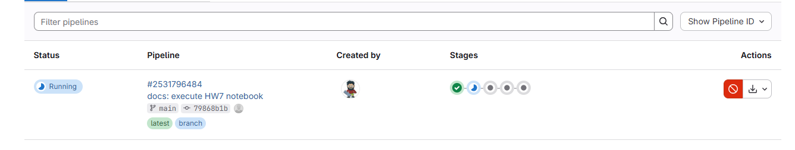
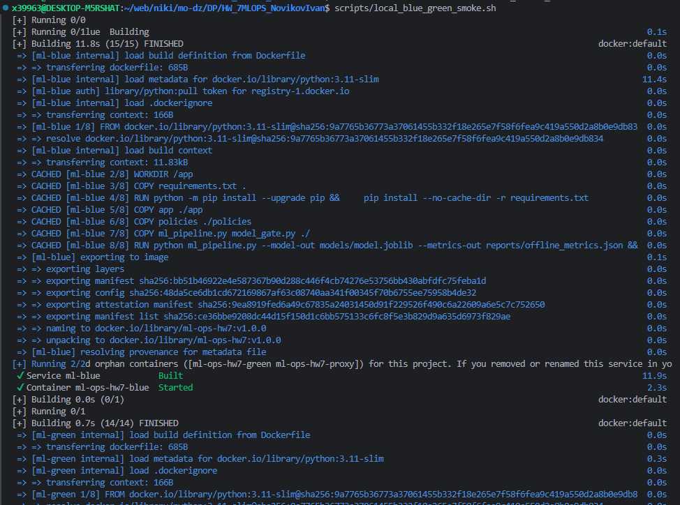
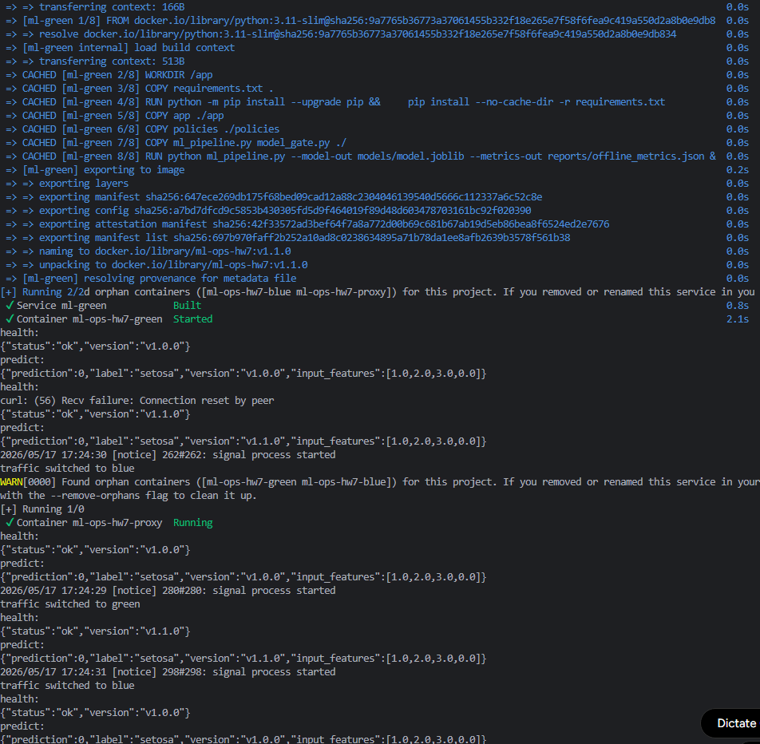
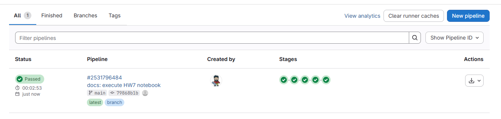
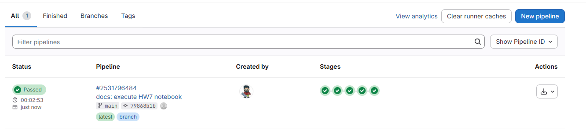

# HW7: CI/CD для ML-сервиса

Небольшой ML-сервис для проверки пайплайна деплоя. Модель обучается на Iris,
сервис отдает `/health`, `/predict` и `/metrics`, а релиз сделан через
Blue-Green схему.

Репозитории:

- GitHub: https://github.com/0x39f963/ml_ops_hw7
- GitLab: https://gitlab.com/anvi.x11/ml_ops_hw7
- Артефакты с картинками: [artifacts/screenshots](artifacts/screenshots)

Основная логика такая:

1. обучаем модель и сохраняем метрики
2. проверяем метрику через model gate
3. гоняем тесты API
4. собираем Docker-образ
5. поднимаем две версии сервиса и переключаем трафик через nginx

## Структура

- `app/` - FastAPI API
- `ml_pipeline.py` - обучение модели
- `model_gate.py` - проверка метрик по policy-файлу
- `policies/model_policy.yaml` - пороги для offline/online проверок
- `tests/` - тесты API и train smoke
- `Dockerfile` - сборка сервиса
- `.gitlab-ci.yml` - GitLab pipeline
- `.github/workflows/ci.yml` - CI в GitHub Actions
- `.github/workflows/deploy.yml` - сборка и публикация Docker image
- `docker-compose.blue.yml` - версия `v1.0.0`
- `docker-compose.green.yml` - версия `v1.1.0`
- `docker-compose.proxy.yml` - nginx-прокси для активной версии
- `scripts/` - smoke, switch и rollback
- `doc/architecture/decisions/` - ADR по выбору стратегии деплоя

## Локальный запуск

```bash
python3 -m venv .venv
source .venv/bin/activate
pip install -r requirements.txt -r requirements-dev.txt
```

Проверка пайплайна:

```bash
python ml_pipeline.py
python model_gate.py
pytest -q
```

После обучения метрики лежат в `reports/offline_metrics.json`.

## API

Запуск без Docker:

```bash
uvicorn app.main:app --host 0.0.0.0 --port 8000
```

Проверка:

```bash
curl http://127.0.0.1:8000/health
curl -X POST http://127.0.0.1:8000/predict \
  -H "Content-Type: application/json" \
  -d '{"x":[1,2,3]}'
```

`/predict` принимает короткий список чисел. Если признаков меньше четырех,
сервис дополняет вход нулями до формата Iris.

## Blue-Green

Варианты сервиса:

- blue - стабильная версия `v1.0.0`
- green - новая версия `v1.1.0`

Запуск:

```bash
docker compose -f docker-compose.blue.yml up -d --build
docker compose -f docker-compose.green.yml up -d --build
```

Прямая проверка версий:

```bash
curl http://127.0.0.1:8001/health
curl http://127.0.0.1:8002/health
```

Прокси работает на `18080`.

```bash
scripts/switch_traffic.sh blue
docker compose -f docker-compose.proxy.yml up -d
scripts/smoke.sh http://127.0.0.1:18080

scripts/switch_traffic.sh green
scripts/smoke.sh http://127.0.0.1:18080
```

Откат:

```bash
scripts/rollback_blue.sh
```

Полная локальная проверка:

```bash
scripts/local_blue_green_smoke.sh
```

## CI/CD

GitLab pipeline состоит из этапов:

- `validate` - быстрая проверка файлов и импорта
- `unit_tests` - pytest
- `train_smoke` - обучение модели и model gate
- `package_manifest` - проверка Docker/compose артефактов
- `deploy_plan` - печатает порядок Blue-Green релиза и rollback

GitHub Actions:

- `CI` - тесты, обучение и model gate
- `Model Deployment` - Docker build, push в GHCR и условный deploy через API

Если `CLOUD_TOKEN` и `DEPLOY_API_URL` не заданы, внешний deploy шаг
пропускается. Сборка и публикация образа при этом остаются отдельным этапом.

Последние успешные запуски на GitHub:

- CI: https://github.com/0x39f963/ml_ops_hw7/actions/runs/25997219876
- Model Deployment: https://github.com/0x39f963/ml_ops_hw7/actions/runs/25997219897

GitLab pipeline:

- https://gitlab.com/anvi.x11/ml_ops_hw7/-/pipelines/2531796484

## Почему Blue-Green

Для сервиса с минимальной обработкой ошибок безопаснее держать старую версию
рядом с новой. Green сначала проверяется отдельно, потом nginx переключает
трафик. Если новая версия отвечает плохо, rollback - это возврат nginx на Blue.

Canary тоже нормальный вариант, но для него нужен настоящий поток запросов и
измерение долей трафика. Shadow безопаснее для рискованных моделей, но в этой
работе он был бы больше схемой, чем локально проверяемым деплоем.

## A/B

A/B-тест здесь идет после релиза, а не вместо него:

- A - `v1.0.0`
- B - `v1.1.0`
- разбиение по `user_id` или `session_id`
- в лог пишутся variant, model_version, prediction, latency и status code
- guardrails: p95 latency меньше 500 ms, error rate меньше 1%, offline accuracy не ниже baseline

Так можно отдельно проверить технику деплоя и отдельно сравнить качество новой
модели на пользовательском трафике.

## Артефакты запуска

Ниже картинки, которые я сохранил после запуска GitHub Actions, GitLab CI и
локального Blue-Green smoke. Они лежат в [artifacts/screenshots](artifacts/screenshots).

### 1. GitHub Actions, общий список

На этой картинке видно оба workflow: `CI` и `Model Deployment`. Последний
коммит `docs: execute HW7 notebook` прошел в обоих workflow.



### 2. GitHub Actions CI

Здесь отдельно открыт workflow `CI`. Он проверяет зависимости, тесты, обучение
модели и model gate.



### 3. GitHub Actions Model Deployment

На этом скрине открыт `Model Deployment`. В нем проверяется сборка Docker image
и шаг деплоя через API, если для него есть секреты.



### 4. GitHub Actions Model Deployment, последний запуск

Та же страница deploy workflow, но с последним запуском наверху. Видно, что
запуск для коммита `79868b1` завершился успешно.



### 5. GitLab pipeline в процессе

Здесь GitLab pipeline уже стартовал после push в GitLab. Первый stage прошел,
следующий еще выполняется.



### 6. GitLab pipeline running

Второй скрин того же pipeline в GitLab. Видно номер pipeline, ветку `main` и
коммит `79868b1`.



### 7. Локальный Docker build

Тут запускается `scripts/local_blue_green_smoke.sh`: собирается образ для blue
версии `v1.0.0`, потом поднимается контейнер `ml-ops-hw7-blue`.



### 8. Локальный Blue-Green smoke

На этом скрине видно полный локальный сценарий: blue отвечает `v1.0.0`, green
отвечает `v1.1.0`, nginx переключается на green и потом rollback возвращает
трафик на blue.



### 9. GitLab pipeline passed, короткий вид

GitLab pipeline завершился успешно. Все stages зеленые.



### 10. GitLab pipeline passed

Финальный вид GitLab pipeline: статус `Passed`, ветка `main`, коммит
`79868b1`, все stages прошли.


